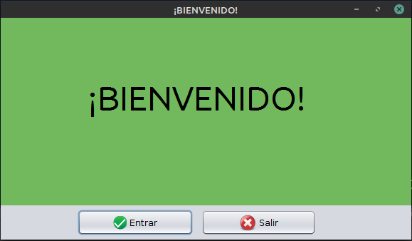
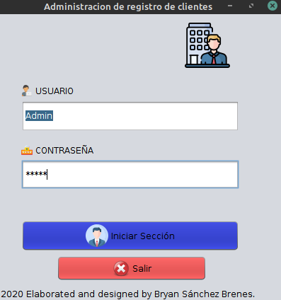
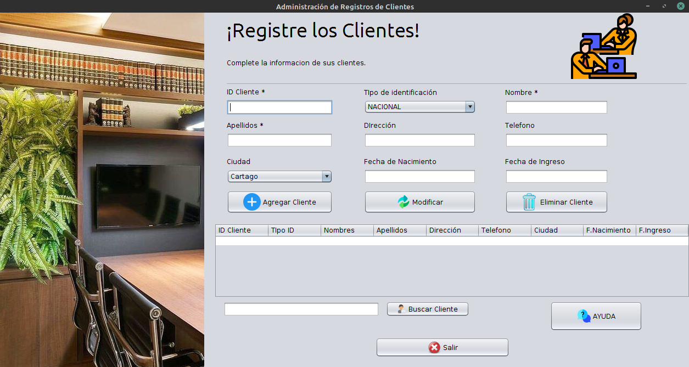

# client-admin

Developer: Bryan Sánchez Brenes. :man_technologist:

# Enunciado. :wink: :cat:
Las herramientas de administración de registro de clientes se utilizan en muchos sectores diferentes para controlar los clientes de la empresas.

## 1. Metodos importantes. :bell: :hammer:
---

### 1. Método para Almacenar en la tabla de datos de clientes. :floppy_disk:
### 2. Método de búsqueda de clientes. :woman:
### 3. Método de Eliminar. :x:
### 4. Login. :computer: :heavy_check_mark:
### 5. Conexión a la base de datos. :vhs:

## 2. SQL. :bookmark_tabs:
---

El gestor utilizado es mySql v8.0.22.
Se utilizara conector mysql para java v8.0.22.

## Codigo de las tablas.

### 1. Login. :heavy_check_mark:

### 2. RegistroCliente. :woman:

## 3. Capturas.

## 4. Fuentes.

